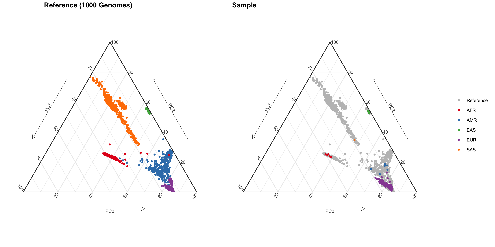

# PCA Ternary Plots

Principal component analysis (PCA) of genetic data can be used to infer ancestry and control for population structure. Population structure can visualized by as a scatter plot of the eigenvectors from the PCA analysis, with the samples of interest projected onto the PCA space of a reference population such as thousand genomes. Here we use a Ternary plot to display the first three PCs.



_PCA Ternary plot showing population structure in 1000 genomes (left) and _

## Usage

`git clone https://github.com/sjfandrews/pc-tern.git`

Depencies include: `tidyverse`, `ggplot2`, `ggtern` and `cowplot`

`intall.packages("tidyverse", "ggplot2", "ggtern", "cowplot")`

Requires principal component eigenvectors generated from `PLINK 1.8` [PCA analysis](https://www.cog-genomics.org/plink/1.9/strat) with samples assigned to a given population cluster. An example data file is available in `data/1kg_pcs.tsv`. This contains a sample data set projected on 1000 genomes using `PLINK --pca` and then assigned to a population cluster based on the euclidean distance from the geomatic median of each PC for a given a cluster. Code used for generating this dataset is in `scripts/make_data.R`   

```
# example plink PCA code
plink --bfile merged-reference-sample-data \
  --pca 10 --within sample_population.txt \
  --pca-clusters population_clusters.txt \
  --out pca.output
```

```
# Example dataset
         fid       iid    PC1    PC2   PC3    PC4    PC5    PC6    PC7    PC8    PC9   PC10    pop super_pop
   1: HG00096   HG00096 -0.008 -0.021 0.007 -0.014 -0.006  0.012 -0.001 -0.005 -0.001 -0.042    GBR       EUR
   2: HG00097   HG00097 -0.007 -0.021 0.008 -0.014 -0.002  0.009 -0.001  0.001 -0.001 -0.036    GBR       EUR
   3: HG00099   HG00099 -0.008 -0.021 0.008 -0.014 -0.002  0.011  0.002 -0.003 -0.004 -0.047    GBR       EUR
   4: HG00100   HG00100 -0.007 -0.021 0.007 -0.013 -0.002  0.008 -0.001  0.000 -0.010 -0.045    GBR       EUR
   5: HG00101   HG00101 -0.007 -0.021 0.008 -0.013 -0.003  0.012  0.002  0.000 -0.009 -0.048    GBR       EUR
  ---                                                                                                        
3206:     109 sample_95 -0.007 -0.021 0.007 -0.013 -0.001  0.008  0.002 -0.002  0.001 -0.018 sample       EUR
3207:     110 sample_96 -0.007 -0.020 0.007 -0.013  0.000 -0.001 -0.002 -0.001  0.003 -0.010 sample       EUR
3208:     113 sample_97 -0.007 -0.021 0.007 -0.012 -0.005  0.006  0.000 -0.001 -0.004 -0.014 sample       EUR
3209:     114 sample_98 -0.007 -0.020 0.007 -0.013  0.000  0.005 -0.001 -0.002 -0.003 -0.014 sample       EUR
3210:     115 sample_99 -0.007 -0.020 0.008 -0.012 -0.004  0.020 -0.003  0.001  0.001 -0.008 sample       EUR
```

`ggtern` is used to plot the population PCs onto a ternary plot. Example code  is available `scripts/pca_tern_plot.R`.
